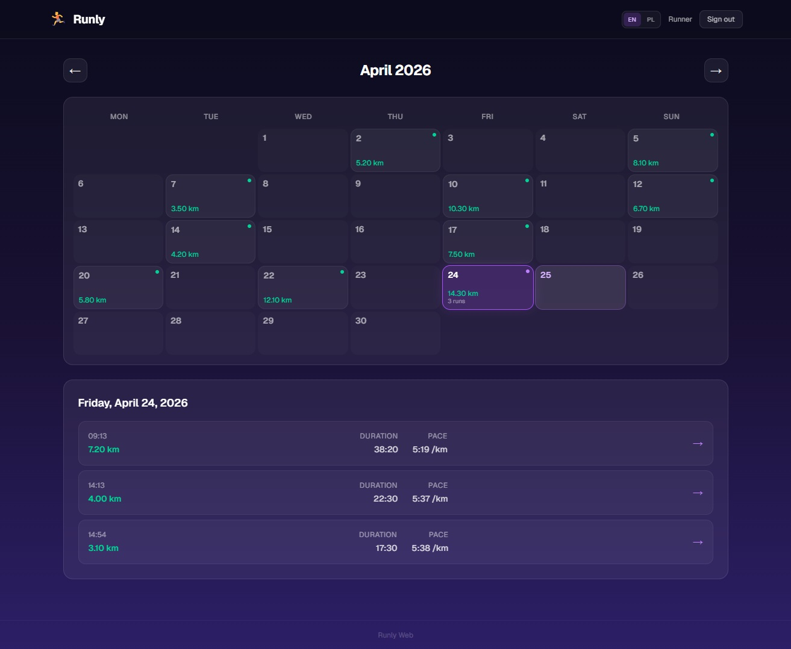
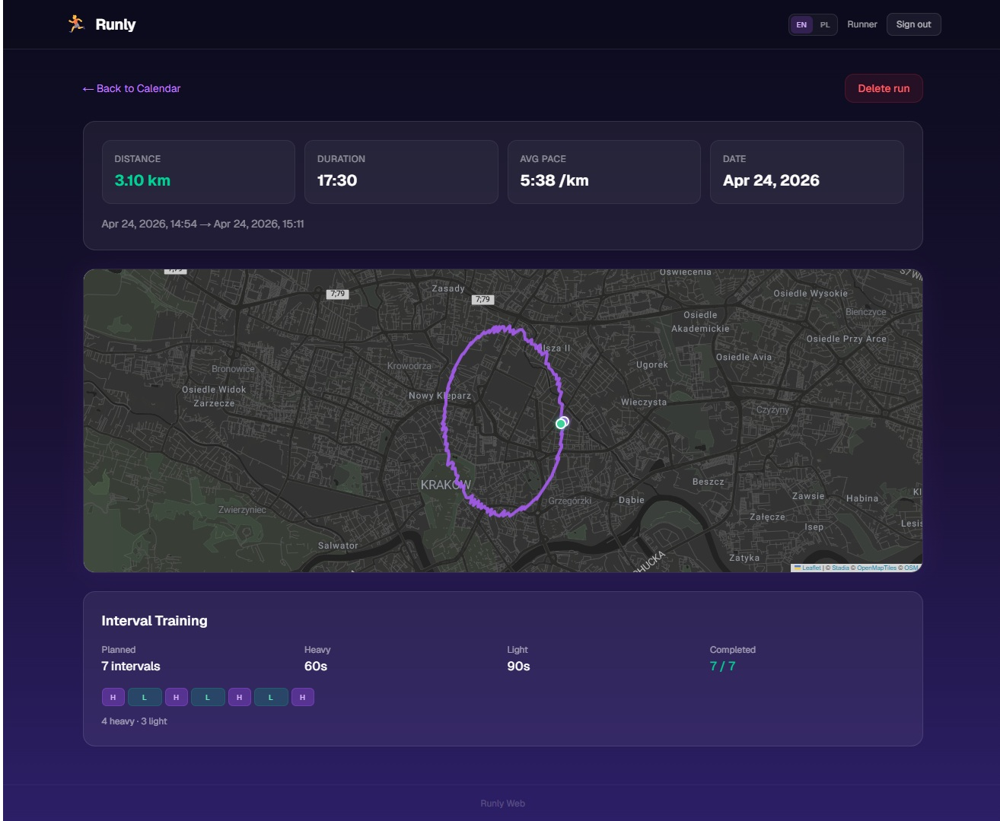

# 🏃 Runly Web

Web dashboard for the Runly running app. View your runs on a calendar, explore route maps, and track interval training — all in a dark glassmorphism UI.

## Screenshots

<p>
  
  
</p>

## Tech Stack

- **Framework:** Next.js 16 (App Router, Server Components)
- **Language:** TypeScript (strict mode)
- **Styling:** Tailwind CSS 4 — dark glassmorphism theme
- **Database:** PostgreSQL (Neon) + Prisma ORM
- **Auth:** NextAuth.js v5 (credentials provider, JWT)
- **Maps:** Leaflet + React Leaflet (dark tiles)
- **Validation:** Zod v4
- **i18n:** i18next (English + Polish)
- **Testing:** Vitest + React Testing Library

## Getting Started

### Prerequisites

- Node.js 20+
- PostgreSQL database (e.g. [Neon](https://neon.tech) free tier)

### Setup

```bash
# Install dependencies
npm install

# Copy environment variables
cp .env.example .env
# Edit .env with your DATABASE_URL and NEXTAUTH_SECRET

# Run database migrations
npx prisma migrate dev

# Seed the database with sample data
npx prisma db seed

# Start development server
npm run dev
```

Open [http://localhost:3000](http://localhost:3000) — you'll be redirected to the login page.

### Seed Account

- **Email:** `runner@runly.app`
- **Password:** `password123`

## Scripts

| Command                | Description               |
| ---------------------- | ------------------------- |
| `npm run dev`          | Start dev server          |
| `npm run build`        | Production build          |
| `npm run start`        | Start production server   |
| `npm run lint`         | ESLint check              |
| `npm run format`       | Prettier format all files |
| `npm run format:check` | Prettier check formatting |
| `npm run test`         | Run tests (Vitest)        |
| `npm run test:watch`   | Run tests in watch mode   |

## Project Structure

```
src/
├── app/                    # Next.js App Router pages & layouts
│   ├── (auth)/             # Login & register (public)
│   ├── (dashboard)/        # Calendar & run details (protected)
│   └── api/                # REST API routes
├── features/               # Feature modules
│   ├── auth/               # Auth actions, components, schemas
│   ├── calendar/           # Calendar grid, navigation, utils
│   ├── navigation/         # UserMenu, LanguageSwitcher
│   └── runs/               # Run stats, map, intervals
├── lib/                    # Shared libraries (auth, db, i18n)
├── consts/                 # App constants
├── ui/                     # Reusable UI components (GlassCard)
├── utils/                  # Pure utility functions
└── types/                  # Global type declarations
```

## Features

- 📅 **Calendar View** — monthly grid with run indicators, day selection
- 🗺️ **Route Map** — interactive Leaflet map with dark tiles, start/end markers
- 📊 **Run Stats** — distance, duration, pace, interval breakdown
- 🔐 **Authentication** — login/register with session protection
- 🌍 **i18n** — English and Polish
- ✨ **Glassmorphism UI** — dark theme with blur effects and purple accents

## API Endpoints

| Method   | Endpoint         | Description                           |
| -------- | ---------------- | ------------------------------------- |
| `GET`    | `/api/runs`      | List runs (optional `?month=YYYY-MM`) |
| `GET`    | `/api/runs/[id]` | Get single run with full data         |
| `POST`   | `/api/runs`      | Create a run (Zod validated)          |
| `DELETE` | `/api/runs/[id]` | Delete a run                          |
| `POST`   | `/api/register`  | Register new user                     |

## License

Private project — not for redistribution.
